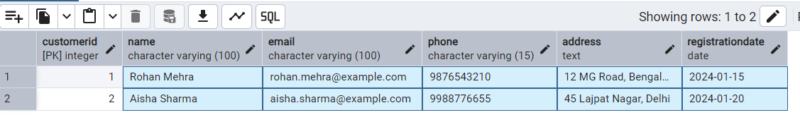

# ecommerce-database
A SQL-based project showcasing schema design, sample data management, and analytical queries for an e-commerce system.
### 1. Fetch All Customers
- **Purpose:** Retrieve all customer details.
- **Results:** Displays all rows and columns from the `Customers` table.
- **Query:**
- - **Query File:** [fetch_all_customers.sql](queries/fetch_all_customers.sql)

  ```sql
  SELECT * FROM Customers;
 
### 2. Total Sales Per Product
- **Purpose:** Calculate total revenue generated for each product.
- **Results:** Displays each product name along with the total revenue generated.
- **Query:**
- - **Query File:** [total_sales_per_product.sql](queries/total_sales_per_product.sql)
  ```sql
  SELECT 
      P.ProductName, 
      SUM(OD.Quantity * OD.PricePerUnit) AS TotalSales
  FROM 
      OrderDetails OD
  INNER JOIN 
      Products P ON OD.ProductID = P.ProductID
  GROUP BY 
      P.ProductName
  ORDER BY 
      TotalSales DESC;
 
  
  


